# 移动端公用登录模块

- [技术栈及版本说明](#chapter-1)
- [安装](#chapter-2)
- [配置](#chapter-3)
- [文件目录说明](#chapter-4)
- [npm 命令说明](#chapter-5)
- [发布模块到公司私有仓库](#chapter-6)

<br/>

### 1. 技术栈及版本说明 <a id="chapter-1" name="chapter-1"></a>

javascript | preprocess | basic ui components | build tool | nodejs 
------------- | ------------- | ------------- | ------------- | -------------
vuejs(`2.6.10`) <br/> vue-router<br/> vuex  | scss(>=1.22.12 node-sass >= `4.12.0`) |  vant(`2.7.1`) | webpack(>=`4.39.3`) | nodejs(`>=10`)

<br/>

### 2. 安装 <a id="chapter-2" name="chapter-2"></a>

<span id="private">因为项目使用了公司私有模块，所以请在安装模块依赖之前请先设置`npm`仓库镜像, 镜像地址为 `http://172.30.0.176:4873/`, 你可以[http://172.30.0.176:4873/](http://172.30.0.176:4873/) 查看我们已经发布的模块。</span>

#### 2.1 使用公司私有npm仓库

##### 2.1.1 安装nodejs
1. 首先你需要安装nodejs并且版本是 >= 10，如没有安装请去往 [https://nodejs.org/zh-cn/](https://nodejs.org/zh-cn/) 下载稳定版本并安装好，安装好后可以在命令行终端输入

2. 安装好npm，npm已经内置于nodejs的安装内，所以无需独立安装。

```shell
# 查看所安装node版本
$ node –v 

# 查看所安装npm 版本
$ npm -v
```

##### 2.1.2 使用npm管理模块依赖

修改npm仓库镜像

```shell
# 查看当前npm仓库地址
$ npm config get registry
# $ http://172.30.0.176:4873/

# 设置公司私有仓库为npm镜像
$ npm config set registry=http://172.30.0.176:4873/
```

##### 2.1.3 使用yarn管理模块依赖

全局安装 yarn 模块

```shell
# 全局安装yarn模块
$ npm install yarn -g

# 查看yarn当前仓库地址
$ yarn config get registry
# $ https://registry.npm.taobao.org/

# 设置公司私有仓库为yarn镜像
yarn config set registry=http://172.30.0.176:4873/
```

##### 2.1.4 安装nrm模块，以方便多个仓库源之间的切换

> 仅适用于npm

```shell
# 安装nrm
$ npm install -g nrm

# 用nrm查看系统已有的registry列表, 其中 * 标识为当前镜像
$ nrm ls
# npm -------- https://registry.npmjs.org/
# yarn ------- https://registry.yarnpkg.com/
# cnpm ------- http://r.cnpmjs.org/
# taobao ----- https://registry.npm.taobao.org/
# nj --------- https://registry.nodejitsu.com/
# npmMirror -- https://skimdb.npmjs.com/registry/
# edunpm ----- http://registry.enpmjs.org/
# * private ---- http://172.30.0.176:4873/

# 添加仓库镜像
$ nrm add private http://172.30.0.176:4873/

# 切换仓库镜像
$ nrm use private

# 删除仓库镜像
$ nrm del private
````

<br/>

### 3. 配置 <a id="chapter-3" name="chapter-3"></a>

项目最基本的配置及相关说明如下图（3-1）。

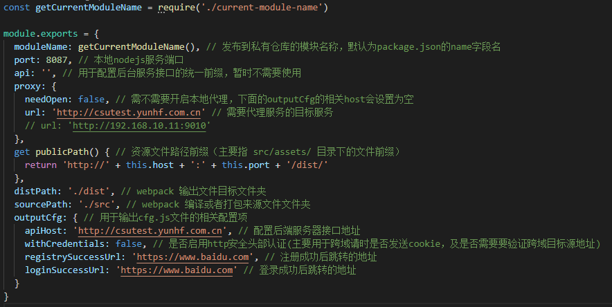


### 4. 文件目录说明 <a id="chapter-4" name="chapter-4"></a>

#### 4.1 配置文件说明

##### 4.1.1 系统环境配置 （config目录）

以 `env`开头的文件跟环境配置相关, 以`webpack`开头的文件跟webpack相关。

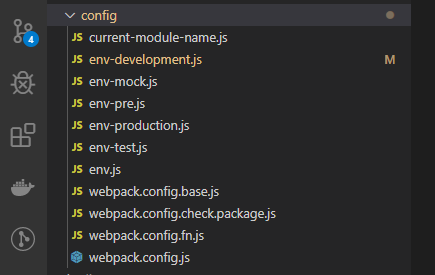

##### 4.1.2 其他配置 （根目录下面的其他配置文件）

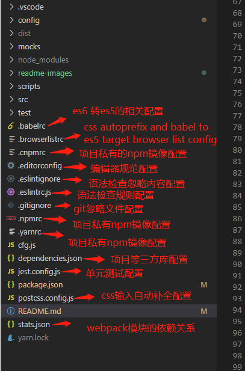

#### 4.2 接口模拟(mocks目录)

项目在 `mock`环境下模拟后台接口返回，无需接入后台，方便前端人员调试前端逻辑。

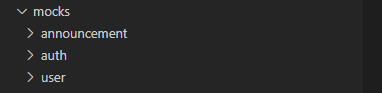

#### 4.2 脚本代码说明 （scripts目录）

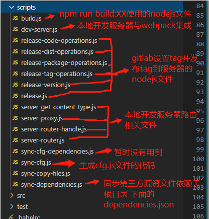

#### 4.3 项目代码分布说明 ( src 目录)

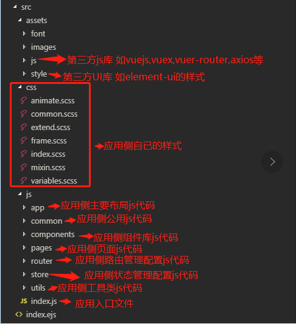

<br/>

### 5. npm 命令说明 <a id="chapter-5" name="chapter-5"></a>

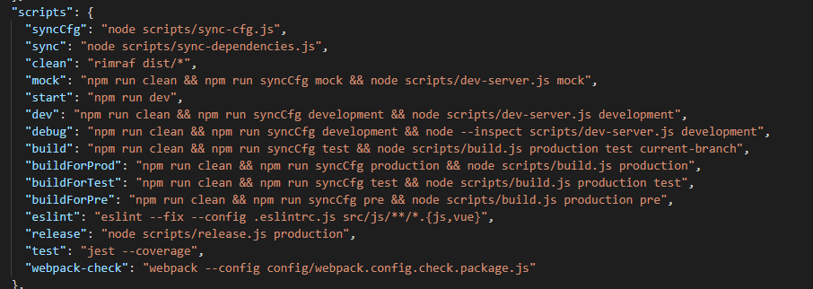

```shell
# syncCfg 用于生成cfg.js命令
$ npm run syncCfg

# sync 用于同步第三方资源库，依赖于根目录下的dependencies.jsons配置文件
$ npm run sync

# clean 清空打包目录下面的内容
$ npm run clean

# mock 使用mock环境
$ npm run mock

# start 使用开发环境
$ npm start

# dev 使用开发环境
$ npm run dev

# debug 使用带调试的开发环境（主要用于nodejs的代码调试）
$ npm run dev

# build 使用测试环境的相关配置来构建打包
$ npm run build

# buildForProd 使用线上环境的相关配置来构建打包
$ npm run buildForProd

# buildForTest 使用测试环境的相关配置来构建打包
$ npm run buildForTest

# buildForPre 使用预生产环境的相关配置来构建打包
$ npm run buildForPre

# eslint 运行语法检查
$ npm run eslint

# test 运行单元测试
$ npm run test

# webpack-check 使用webpack-cli来构建打包， 默认是production
$ npm run webpack-check

# release 打tag并且将tag推送到gitlab服务器(需要操作git的账号据有master权限)
$ npm run release
```

<br/>

### 6. 发布模块到公司私有仓库 <a id="chapter-6" name="chapter-6"></a>

ndejs的安装及npm仓库的配置请查看 [2.1 使用公司私有npm仓库](#private)，下图为私有仓库的结构图。

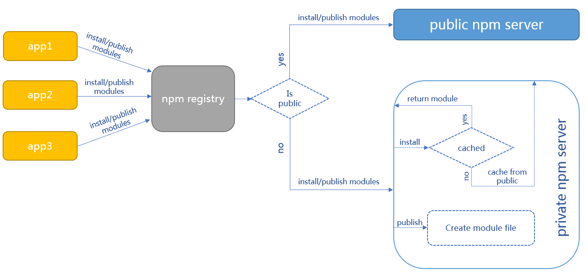

#### 6.1 你需要在我们的npm私有仓库注册新账户，你可以在终端执行命令

```shell
$ npm adduser --registry http://172.30.0.176:4873/
# 在运行完上述命令后你需要输入注册的用户名跟密码及邮箱信息
$ Username: test_99
$ Password: 123456
$ Email: (this IS public) abc@163.com

```

#### 6.2 登录我们的npm私有仓库
```shell
$ npm login --registry http://172.30.0.176:4873/
```

在运行完上述命令后你需要输入注册的用户名跟密码及邮箱信息，如果信息没有错误将登录成功

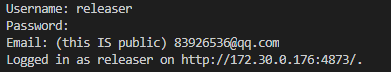

#### 6.3 登录成功后输入npm publish发布模块

```shell
$ npm publish
```

如果出现下述表示发布成功 (这里的截图是以hf-vue-ui模块为例的)

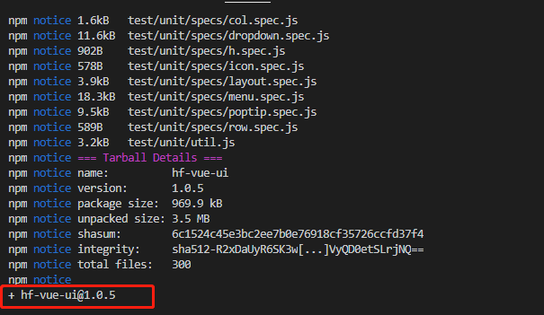


#### 6.4 查看发布后的结果

发布成功的模块可以在我们的仓库web端进行查看，web端地址为 [http://172.30.0.176:4873/](http://172.30.0.176:4873/)

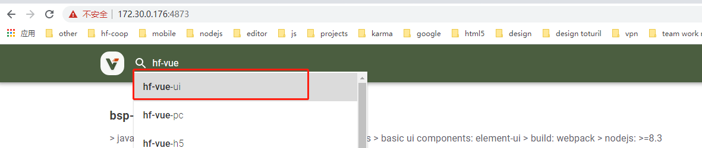

<br/>

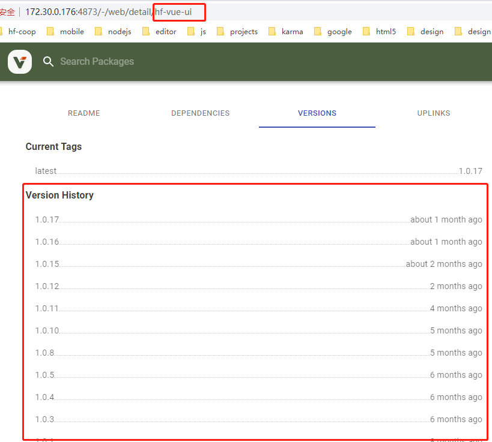

<br/>
